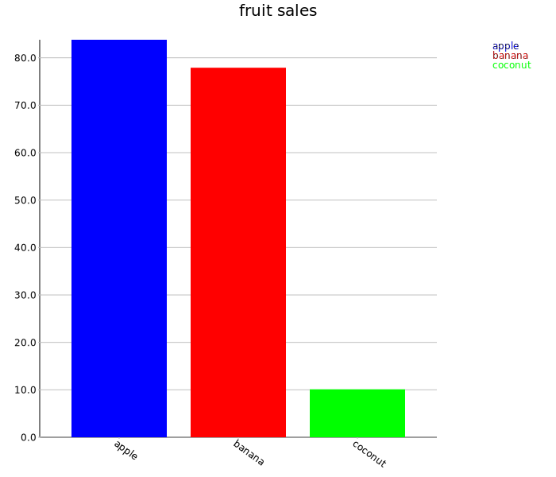

Bar Charts
==========

Two-dimensional bar charts.

Example
-------

The dataset:

```scala
scala> val sales = Map(
     |   "apple" -> 83.8,
     |   "banana" -> 77.9,
     |   "coconut" -> 10.1
     | )
sales: scala.collection.immutable.Map[String,Double] = Map(apple -> 83.8, banana -> 77.9, coconut -> 10.1)
```

Can be visualized as a bar chart with:

```scala
scala> import spire.implicits.DoubleAlgebra
import spire.implicits.DoubleAlgebra

scala> import spire.implicits.StringOrder
import spire.implicits.StringOrder

scala> import axle.visualize.BarChart
import axle.visualize.BarChart

scala> val chart = BarChart[String, Double, Map[String, Double]](
     |   sales,
     |   title = Some("fruit sales")
     | )
chart: axle.visualize.BarChart[String,Double,Map[String,Double]] = BarChart(Map(apple -> 83.8, banana -> 77.9, coconut -> 10.1),true,700,600,50,0.8,20,50,80,Some(fruit sales),None,Courier New,12,Palatino,20,None,None,None,UnittedQuantity(36.0,UnitOfMeasurement(degree,°,Some(http://en.wikipedia.org/wiki/Degree_(angle)))),List(Color(0,0,255), Color(255,0,0), Color(0,255,0), Color(255,200,0), Color(255,175,175), Color(255,255,0)))

scala> import axle.web._
import axle.web._

scala> svg(chart, "fruitsales.svg")
```


