Bayesian Networks
=================

See the Wikipedia page on <a href="https://en.wikipedia.org/wiki/Bayesian_network">Bayesian networks</a>


Alarm Example
-------------

Imports

```scala
import axle._
import axle.algebra.DirectedGraph
import axle.stats._
import axle.pgm._
import spire.math._
import spire.implicits._
import axle.jblas._
import axle.jung.directedGraphJung
import edu.uci.ics.jung.graph.DirectedSparseGraph
```

Setup

```scala
scala> val bools = Vector(true, false)
bools: scala.collection.immutable.Vector[Boolean] = Vector(true, false)

scala> val B = UnknownDistribution0[Boolean, Rational](bools, "Burglary")
B: axle.stats.UnknownDistribution0[Boolean,spire.math.Rational] = UnknownDistribution0(Vector(true, false),Burglary)

scala> val E = UnknownDistribution0[Boolean, Rational](bools, "Earthquake")
E: axle.stats.UnknownDistribution0[Boolean,spire.math.Rational] = UnknownDistribution0(Vector(true, false),Earthquake)

scala> val A = UnknownDistribution0[Boolean, Rational](bools, "Alarm")
A: axle.stats.UnknownDistribution0[Boolean,spire.math.Rational] = UnknownDistribution0(Vector(true, false),Alarm)

scala> val J = UnknownDistribution0[Boolean, Rational](bools, "John Calls")
J: axle.stats.UnknownDistribution0[Boolean,spire.math.Rational] = UnknownDistribution0(Vector(true, false),John Calls)

scala> val M = UnknownDistribution0[Boolean, Rational](bools, "Mary Calls")
M: axle.stats.UnknownDistribution0[Boolean,spire.math.Rational] = UnknownDistribution0(Vector(true, false),Mary Calls)

scala> val bFactor =
     |   Factor(Vector(B), Map(
     |     Vector(B is true) -> Rational(1, 1000),
     |     Vector(B is false) -> Rational(999, 1000)))
bFactor: axle.stats.Factor[Boolean,spire.math.Rational] = Factor(Vector(UnknownDistribution0(Vector(true, false),Burglary)),Map(Vector(CaseIs(UnknownDistribution0(Vector(true, false),Burglary),true)) -> 1/1000, Vector(CaseIs(UnknownDistribution0(Vector(true, false),Burglary),false)) -> 999/1000))

scala> val eFactor =
     |   Factor(Vector(E), Map(
     |     Vector(E is true) -> Rational(1, 500),
     |     Vector(E is false) -> Rational(499, 500)))
eFactor: axle.stats.Factor[Boolean,spire.math.Rational] = Factor(Vector(UnknownDistribution0(Vector(true, false),Earthquake)),Map(Vector(CaseIs(UnknownDistribution0(Vector(true, false),Earthquake),true)) -> 1/500, Vector(CaseIs(UnknownDistribution0(Vector(true, false),Earthquake),false)) -> 499/500))

scala> val aFactor =
     |   Factor(Vector(B, E, A), Map(
     |     Vector(B is false, E is false, A is true) -> Rational(1, 1000),
     |     Vector(B is false, E is false, A is false) -> Rational(999, 1000),
     |     Vector(B is true, E is false, A is true) -> Rational(940, 1000),
     |     Vector(B is true, E is false, A is false) -> Rational(60, 1000),
     |     Vector(B is false, E is true, A is true) -> Rational(290, 1000),
     |     Vector(B is false, E is true, A is false) -> Rational(710, 1000),
     |     Vector(B is true, E is true, A is true) -> Rational(950, 1000),
     |     Vector(B is true, E is true, A is false) -> Rational(50, 1000)))
aFactor: axle.stats.Factor[Boolean,spire.math.Rational] = Factor(Vector(UnknownDistribution0(Vector(true, false),Burglary), UnknownDistribution0(Vector(true, false),Earthquake), UnknownDistribution0(Vector(true, false),Alarm)),Map(Vector(CaseIs(UnknownDistribution0(Vector(true, false),Burglary),false), CaseIs(UnknownDistribution0(Vector(true, false),Earthquake),true), CaseIs(UnknownDistribution0(Vector(true, false),Alarm),false)) -> 71/100, Vector(CaseIs(UnknownDistribution0(Vector(true, false),Burglary),true), CaseIs(UnknownDistribution0(Vector(true, false),Earthquake),true), CaseIs(UnknownDistribution0(Vector(true, false),Alarm),false)) -> 1/20, Vector(CaseIs(UnknownDistribution0(Vector(true, false),Burglary),true), CaseIs(UnknownDistribution0(Vector(true, false),Earthquake),true), Ca...

scala> val jFactor =
     |   Factor(Vector(A, J), Map(
     |     Vector(A is true, J is true) -> Rational(9, 10),
     |     Vector(A is true, J is false) -> Rational(1, 10),
     |     Vector(A is false, J is true) -> Rational(5, 100),
     |     Vector(A is false, J is false) -> Rational(95, 100)))
jFactor: axle.stats.Factor[Boolean,spire.math.Rational] = Factor(Vector(UnknownDistribution0(Vector(true, false),Alarm), UnknownDistribution0(Vector(true, false),John Calls)),Map(Vector(CaseIs(UnknownDistribution0(Vector(true, false),Alarm),true), CaseIs(UnknownDistribution0(Vector(true, false),John Calls),true)) -> 9/10, Vector(CaseIs(UnknownDistribution0(Vector(true, false),Alarm),true), CaseIs(UnknownDistribution0(Vector(true, false),John Calls),false)) -> 1/10, Vector(CaseIs(UnknownDistribution0(Vector(true, false),Alarm),false), CaseIs(UnknownDistribution0(Vector(true, false),John Calls),true)) -> 1/20, Vector(CaseIs(UnknownDistribution0(Vector(true, false),Alarm),false), CaseIs(UnknownDistribution0(Vector(true, false),John Calls),false)) -> 19/20))

scala> val mFactor =
     |   Factor(Vector(A, M), Map(
     |     Vector(A is true, M is true) -> Rational(7, 10),
     |     Vector(A is true, M is false) -> Rational(3, 10),
     |     Vector(A is false, M is true) -> Rational(1, 100),
     |     Vector(A is false, M is false) -> Rational(99, 100)))
mFactor: axle.stats.Factor[Boolean,spire.math.Rational] = Factor(Vector(UnknownDistribution0(Vector(true, false),Alarm), UnknownDistribution0(Vector(true, false),Mary Calls)),Map(Vector(CaseIs(UnknownDistribution0(Vector(true, false),Alarm),true), CaseIs(UnknownDistribution0(Vector(true, false),Mary Calls),true)) -> 7/10, Vector(CaseIs(UnknownDistribution0(Vector(true, false),Alarm),true), CaseIs(UnknownDistribution0(Vector(true, false),Mary Calls),false)) -> 3/10, Vector(CaseIs(UnknownDistribution0(Vector(true, false),Alarm),false), CaseIs(UnknownDistribution0(Vector(true, false),Mary Calls),true)) -> 1/100, Vector(CaseIs(UnknownDistribution0(Vector(true, false),Alarm),false), CaseIs(UnknownDistribution0(Vector(true, false),Mary Calls),false)) -> 99/100))

scala> // edges: ba, ea, aj, am
     | val bn = BayesianNetwork.withGraphK2[Boolean, Rational, DirectedSparseGraph](
     |   "A sounds (due to Burglary or Earthquake) and John or Mary Call",
     |   Map(B -> bFactor,
     |     E -> eFactor,
     |     A -> aFactor,
     |     J -> jFactor,
     |     M -> mFactor))
bn: axle.pgm.BayesianNetwork[Boolean,spire.math.Rational,edu.uci.ics.jung.graph.DirectedSparseGraph[axle.pgm.BayesianNetworkNode[Boolean,spire.math.Rational],axle.pgm.Edge]] = BayesianNetwork(A sounds (due to Burglary or Earthquake) and John or Mary Call,Map(UnknownDistribution0(Vector(true, false),Alarm) -> Factor(Vector(UnknownDistribution0(Vector(true, false),Burglary), UnknownDistribution0(Vector(true, false),Earthquake), UnknownDistribution0(Vector(true, false),Alarm)),Map(Vector(CaseIs(UnknownDistribution0(Vector(true, false),Burglary),false), CaseIs(UnknownDistribution0(Vector(true, false),Earthquake),true), CaseIs(UnknownDistribution0(Vector(true, false),Alarm),false)) -> 71/100, Vector(CaseIs(UnknownDistribution0(Vector(true, false),Burglary),true), CaseIs(UnknownDistribution0(...
```

An AWT visualization is available with:

```scala
scala> import axle.visualize._
import axle.visualize._

scala> import axle.web._
import axle.web._

scala> svg(bn, "alarmbayes.svg")
java.lang.NoClassDefFoundError: edu/uci/ics/jung/visualization/DefaultVisualizationModel
  at axle.web.SVG$$anon$18.svg(SVG.scala:495)
  at axle.web.SVG$$anon$18.svg(SVG.scala:479)
  at axle.web.SVG$$anon$21.svg(SVG.scala:618)
  at axle.web.SVG$$anon$21.svg(SVG.scala:616)
  at axle.web.package$.svg(package.scala:26)
  ... 486 elided
Caused by: java.lang.ClassNotFoundException: edu.uci.ics.jung.visualization.DefaultVisualizationModel
  at java.net.URLClassLoader.findClass(URLClassLoader.java:381)
  at java.lang.ClassLoader.loadClass(ClassLoader.java:424)
  at java.lang.ClassLoader.loadClass(ClassLoader.java:357)
  ... 491 more
```



The network can be used to compute the joint probability table:

```scala
scala> val jpt = bn.jointProbabilityTable
jpt: axle.stats.Factor[Boolean,spire.math.Rational] = Factor(Vector(UnknownDistribution0(Vector(true, false),Burglary), UnknownDistribution0(Vector(true, false),Mary Calls), UnknownDistribution0(Vector(true, false),Earthquake), UnknownDistribution0(Vector(true, false),John Calls), UnknownDistribution0(Vector(true, false),Alarm)),Map(Vector(CaseIs(UnknownDistribution0(Vector(true, false),Burglary),false), CaseIs(UnknownDistribution0(Vector(true, false),Mary Calls),true), CaseIs(UnknownDistribution0(Vector(true, false),Earthquake),true), CaseIs(UnknownDistribution0(Vector(true, false),John Calls),false), CaseIs(UnknownDistribution0(Vector(true, false),Alarm),true)) -> 202797/5000000000, Vector(CaseIs(UnknownDistribution0(Vector(true, false),Burglary),true), CaseIs(UnknownDistribution0(Vec...

scala> string(jpt)
res2: String =
Burglary Mary Calls Earthquake John Calls Alarm
true     true       true       true       true  1197/1000000000
true     true       true       true       false 1/20000000000
true     true       true       false      true  133/1000000000
true     true       true       false      false 19/20000000000
true     true       false      true       true  1477539/2500000000
true     true       false      true       false 1497/50000000000
true     true       false      false      true  164171/2500000000
true     true       false      false      false 28443/50000000000
true     false      true       true       true  513/1000000000
true     false      true       true       false 99/20000000000
true     false      true       false      true  57/1000000000
true     false      true      ...
```

Variables can be summed out of the factor:

```scala
scala> jpt.Σ(M).Σ(J).Σ(A).Σ(B).Σ(E)
res3: axle.stats.Factor[Boolean,spire.math.Rational] = Factor(Vector(),Map(Vector() -> 1))
```

```scala
scala> jpt.sumOut(M).sumOut(J).sumOut(A).sumOut(B).sumOut(E)
res4: axle.stats.Factor[Boolean,spire.math.Rational] = Factor(Vector(),Map(Vector() -> 1))
```

Multiplication of factors also works:

```scala
scala> val f = (bn.cpt(A) * bn.cpt(B)) * bn.cpt(E)
f: axle.stats.Factor[Boolean,spire.math.Rational] = Factor(Vector(UnknownDistribution0(Vector(true, false),Burglary), UnknownDistribution0(Vector(true, false),Earthquake), UnknownDistribution0(Vector(true, false),Alarm)),Map(Vector(CaseIs(UnknownDistribution0(Vector(true, false),Burglary),false), CaseIs(UnknownDistribution0(Vector(true, false),Earthquake),true), CaseIs(UnknownDistribution0(Vector(true, false),Alarm),false)) -> 70929/50000000, Vector(CaseIs(UnknownDistribution0(Vector(true, false),Burglary),true), CaseIs(UnknownDistribution0(Vector(true, false),Earthquake),true), CaseIs(UnknownDistribution0(Vector(true, false),Alarm),false)) -> 1/10000000, Vector(CaseIs(UnknownDistribution0(Vector(true, false),Burglary),true), CaseIs(UnknownDistribution0(Vector(true, false),Earthquake),t...

scala> string(f)
res5: String =
Burglary Earthquake Alarm
true     true       true  19/10000000
true     true       false 1/10000000
true     false      true  23453/25000000
true     false      false 1497/25000000
false    true       true  28971/50000000
false    true       false 70929/50000000
false    false      true  498501/500000000
false    false      false 498002499/500000000
```

Markov assumptions:

```scala
scala> string(bn.markovAssumptionsFor(M))
res6: String = I({Mary Calls}, {Alarm}, {Burglary, Earthquake, John Calls})
```

This is read as "M is independent of E, B, and J given A".
