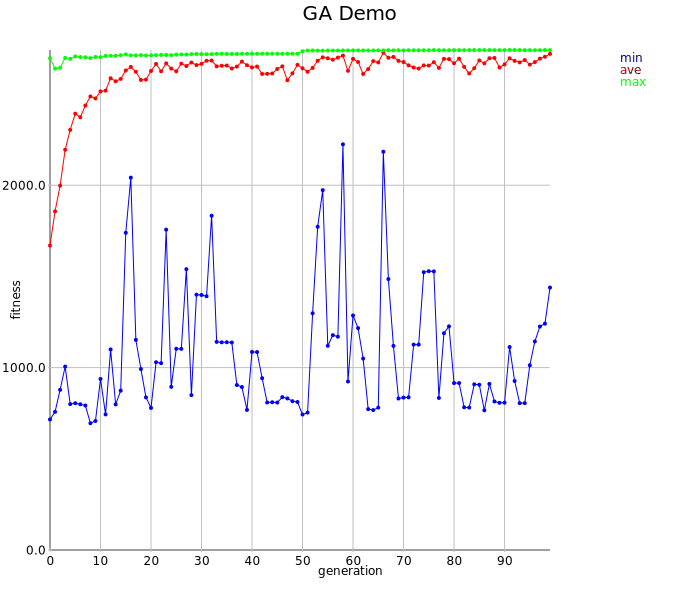

Genetic Algorithms
==================

See the wikipedia page on <a href="https://en.wikipedia.org/wiki/Genetic_algorithm">Genetic Algorithms</a>

Example
-------

```scala
scala> case class Rabbit(a: Int, b: Double, c: Double, d: Double, e: Double, f: Double, g: Double, h: Double)
defined class Rabbit
```

Define a random rabbit generator and fitness function

```scala
scala> import shapeless._
import shapeless._

scala> import syntax.singleton._
import syntax.singleton._

scala> import record._
import record._

scala> import util.Random.nextDouble
import util.Random.nextDouble

scala> import util.Random.nextInt
import util.Random.nextInt

scala> import axle.ml._
import axle.ml._

scala> val gen = Generic[Rabbit]
gen: shapeless.Generic[Rabbit]{type Repr = shapeless.::[Int,shapeless.::[Double,shapeless.::[Double,shapeless.::[Double,shapeless.::[Double,shapeless.::[Double,shapeless.::[Double,shapeless.::[Double,shapeless.HNil]]]]]]]]} = anon$macro$9$1@15410ecb

scala> // val pMutation = 0.003
     | 
     | implicit val rabbitSpecies = new Species[gen.Repr] {
     | 
     |   def random() = {
     |     val rabbit = Rabbit(
     |       1 + nextInt(2),
     |       5 + 20 * nextDouble(),
     |       1 + 4 * nextDouble(),
     |       3 + 10 * nextDouble(),
     |       10 + 5 * nextDouble(),
     |       2 + 2 * nextDouble(),
     |       3 + 5 * nextDouble(),
     |       2 + 10 * nextDouble())
     |     gen.to(rabbit)
     |   }
     | 
     |   def fitness(rg: gen.Repr): Double = {
     |     val rabbit = gen.from(rg)
     |     import rabbit._
     |     a * 100 + 100.0 * b + 2.2 * (1.1 * c + 0.3 * d) + 1.3 * (1.4 * e - 3.1 * f + 1.3 * g) - 1.4 * h
     |   }
     | 
     | }
rabbitSpecies: axle.ml.Species[gen.Repr] = $anon$1@5af8416e
```

Run the genetic algorithm

```scala
scala> import spire.implicits._
import spire.implicits._

scala> val ga = GeneticAlgorithm(populationSize = 100, numGenerations = 100)
ga: axle.ml.GeneticAlgorithm[gen.Repr,this.Out] = GeneticAlgorithm(100,100)

scala> val log = ga.run()
log: axle.ml.GeneticAlgorithmLog[gen.Repr] = GeneticAlgorithmLog(Vector((2 :: 24.774310487595642 :: 4.5730421919492645 :: 11.99554846415289 :: 14.545724126319868 :: 3.937775044969669 :: 7.984583029997104 :: 2.0630138037519714 :: HNil,2717.6245833245384), (2 :: 24.774310487595642 :: 4.745111437916755 :: 11.99554846415289 :: 14.545724126319868 :: 2.0710140581835215 :: 7.913385564235423 :: 2.0630138037519714 :: HNil,2725.443713959391), (2 :: 24.774310487595642 :: 4.734122984719864 :: 11.99554846415289 :: 14.646714712029917 :: 2.086993463530151 :: 7.913385564235423 :: 2.0630138037519714 :: HNil,2725.5365277651), (2 :: 24.774310487595642 :: 4.745111437916755 :: 12.142406778110661 :: 14.993637861461348 :: 2.086993463530151 :: 7.191579560253437 :: 2.0630138037519714 :: HNil,2725.071594294284),...
```

Plot the min, average, and max fitness function by generation

```scala
scala> import scala.collection.immutable.TreeMap
import scala.collection.immutable.TreeMap

scala> import axle.visualize._
import axle.visualize._

scala> val plot = Plot(
     |   List("min" -> log.mins, "ave" -> log.aves, "max" -> log.maxs),
     |   connect = true,
     |   title = Some("GA Demo"),
     |   xAxis = Some(0d),
     |   xAxisLabel = Some("generation"),
     |   yAxis = Some(0),
     |   yAxisLabel = Some("fitness"))
plot: axle.visualize.Plot[Int,Double,scala.collection.immutable.TreeMap[Int,Double]] = Plot(List((min,Map(0 -> 727.2916103819108, 1 -> 852.6016107252431, 2 -> 849.4772180321679, 3 -> 774.9050976098844, 4 -> 776.3674313021763, 5 -> 821.0145855282401, 6 -> 1027.4942016659363, 7 -> 1093.4315889196275, 8 -> 833.7143312702333, 9 -> 1324.088075098016, 10 -> 1323.876882777189, 11 -> 1125.0233761153772, 12 -> 1223.7845335046218, 13 -> 1328.7035565699935, 14 -> 1278.254405063019, 15 -> 829.5337610239606, 16 -> 1613.8729392786781, 17 -> 1077.7700196603412, 18 -> 799.6034688724234, 19 -> 1326.5171673358775, 20 -> 1937.976419081201, 21 -> 1611.9933876369475, 22 -> 1361.2776966586857, 23 -> 1365.5017291641793, 24 -> 1067.1835067787495, 25 -> 997.0440874267969, 26 -> 1901.66845074247, 27 -> 2056.9512...

scala> import axle.web._
import axle.web._

scala> svg(plot, "ga.svg")
```


