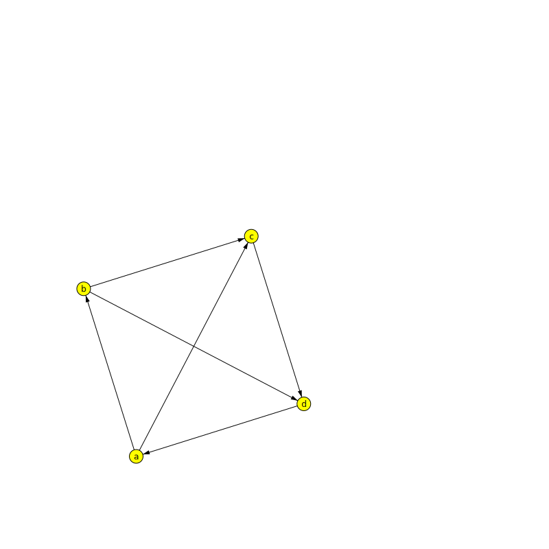
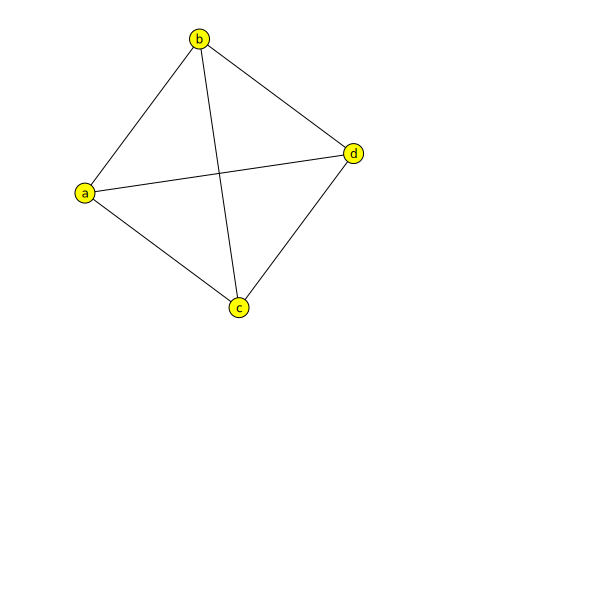

Graph
=====

DirectedGraph typeclass and witnesses for the Jung package

Directed Graph
--------------

Imports and implicits

```scala
import axle._
import axle.algebra._
import axle.jung._
import axle.syntax.directedgraph.directedGraphOps
import axle.syntax.undirectedgraph.undirectedGraphOps
import spire.implicits.StringOrder
import spire.implicits.eqOps
import axle.syntax.finite.finiteOps
import edu.uci.ics.jung.graph.DirectedSparseGraph

class Edge
implicit val showEdge: Show[Edge] = new Show[Edge] { def text(e: Edge): String = "" }
```

Example

```scala
scala> val jdg = DirectedGraph.k2[DirectedSparseGraph, String, Edge]
jdg: axle.algebra.DirectedGraph[edu.uci.ics.jung.graph.DirectedSparseGraph[String,Edge],String,Edge] = axle.jung.package$$anon$4@1b55d5f4

scala> val a = "a"
a: String = a

scala> val b = "b"
b: String = b

scala> val c = "c"
c: String = c

scala> val d = "d"
d: String = d

scala> val dg = jdg.make(List(a, b, c, d),
     |   List(
     |     (a, b, new Edge),
     |     (b, c, new Edge),
     |     (c, d, new Edge),
     |     (d, a, new Edge),
     |     (a, c, new Edge),
     |     (b, d, new Edge)))
dg: edu.uci.ics.jung.graph.DirectedSparseGraph[String,Edge] =
Vertices:a,b,c,d
Edges:Edge@707b704b[b,d] Edge@77dad76e[d,a] Edge@2c85e7f3[b,c] Edge@796fbe39[c,d] Edge@72eede54[a,b] Edge@73c2abbf[a,c]
```

```scala
scala> dg.size
res1: Int = 4

scala> dg.findVertex(_ === "a").map(v => dg.successors(v))
res2: Option[Set[String]] = Some(Set(b, c))

scala> dg.findVertex(_ === "c").map(v => dg.successors(v))
res3: Option[Set[String]] = Some(Set(d))

scala> dg.findVertex(_ === "c").map(v => dg.predecessors(v))
res4: Option[Set[String]] = Some(Set(a, b))

scala> dg.findVertex(_ === "c").map(v => dg.neighbors(v))
res5: Option[Set[String]] = Some(Set(a, b, d))
```

Visualize the graph

```scala
scala> import axle.web._
import axle.web._

scala> svg(dg, "SimpleDirectedGraph.svg")
```



Undirected Graph
----------------

Imports and implicits

```scala
import edu.uci.ics.jung.graph.UndirectedSparseGraph

class Edge
implicit val showEdge: Show[Edge] = new Show[Edge] { def text(e: Edge): String = "" }
```

Example

```scala
scala> val jug = UndirectedGraph.k2[UndirectedSparseGraph, String, Edge]
jug: axle.algebra.UndirectedGraph[edu.uci.ics.jung.graph.UndirectedSparseGraph[String,Edge],String,Edge] = axle.jung.package$$anon$8@2e13a98e

scala> val a = "a"
a: String = a

scala> val b = "b"
b: String = b

scala> val c = "c"
c: String = c

scala> val d = "d"
d: String = d

scala> val ug = jug.make(List(a, b, c, d),
     |   List(
     |     (a, b, new Edge),
     |     (b, c, new Edge),
     |     (c, d, new Edge),
     |     (d, a, new Edge),
     |     (a, c, new Edge),
     |     (b, d, new Edge)))
ug: edu.uci.ics.jung.graph.UndirectedSparseGraph[String,Edge] =
Vertices:a,b,c,d
Edges:Edge@4cdb868b[a,b] Edge@199b48fa[d,a] Edge@35f1bca3[b,c] Edge@9646a9c[a,c] Edge@4b083735[c,d] Edge@31c8cbb7[b,d]
```

```scala
scala> ug.size
res8: Int = 4

scala> ug.findVertex(_ == "c").map(v => ug.neighbors(v))
res9: Option[Set[String]] = Some(Set(a, b, d))

scala> ug.findVertex(_ == "a").map(v => ug.neighbors(v))
res10: Option[Set[String]] = Some(Set(b, c, d))
```

Visualize the graph

```scala
scala> import axle.web._
import axle.web._

scala> svg(ug, "SimpleUndirectedGraph.svg")
```


