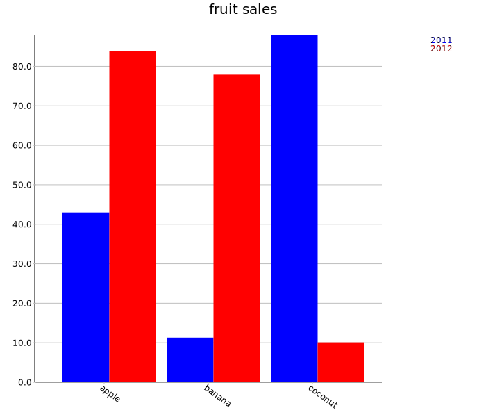
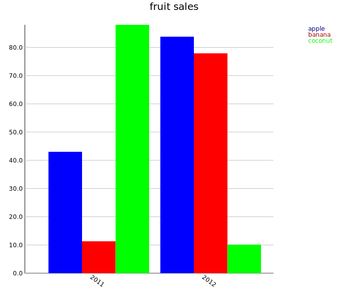

Grouped Bar Charts
==================

Two-dimensional grouped bar charts

Example
-------

The following example dataset:

```scala
scala> val sales = Map(
     |   ("apple", 2011) -> 43.0,
     |   ("apple", 2012) -> 83.8,
     |   ("banana", 2011) -> 11.3,
     |   ("banana", 2012) -> 77.9,
     |   ("coconut", 2011) -> 88.0,
     |   ("coconut", 2012) -> 10.1
     | )
sales: scala.collection.immutable.Map[(String, Int),Double] = Map((coconut,2011) -> 88.0, (banana,2012) -> 77.9, (apple,2012) -> 83.8, (apple,2011) -> 43.0, (banana,2011) -> 11.3, (coconut,2012) -> 10.1)
```

Can be grouped in two ways to produce bar charts:

```scala
scala> import spire.implicits.DoubleAlgebra
import spire.implicits.DoubleAlgebra

scala> import spire.implicits.IntAlgebra
import spire.implicits.IntAlgebra

scala> import spire.implicits.StringOrder
import spire.implicits.StringOrder

scala> import axle.visualize.BarChartGrouped
import axle.visualize.BarChartGrouped

scala> val chart = BarChartGrouped[String, Int, Double, Map[(String, Int), Double]](
     |   sales,
     |   title = Some("fruit sales")
     | )
chart: axle.visualize.BarChartGrouped[String,Int,Double,Map[(String, Int),Double]] = BarChartGrouped(Map((coconut,2011) -> 88.0, (banana,2012) -> 77.9, (apple,2012) -> 83.8, (apple,2011) -> 43.0, (banana,2011) -> 11.3, (coconut,2012) -> 10.1),true,700,600,50,0.8,20,50,80,Some(fruit sales),None,Courier New,12,Palatino,20,None,None,None,List(Color(0,0,255), Color(255,0,0), Color(0,255,0), Color(255,200,0), Color(255,175,175), Color(255,255,0)))

scala> import axle.web._
import axle.web._

scala> svg(chart, "barchart1.svg")
```



Or:

```scala
scala> import spire.implicits.DoubleAlgebra
import spire.implicits.DoubleAlgebra

scala> val chart = BarChartGrouped[Int, String, Double, Map[(Int, String), Double]](
     |   sales map { case (k, v) => (k._2, k._1) -> v},
     |   title = Some("fruit sales")
     | )
chart: axle.visualize.BarChartGrouped[Int,String,Double,Map[(Int, String),Double]] = BarChartGrouped(Map((2012,apple) -> 83.8, (2012,banana) -> 77.9, (2011,apple) -> 43.0, (2011,coconut) -> 88.0, (2011,banana) -> 11.3, (2012,coconut) -> 10.1),true,700,600,50,0.8,20,50,80,Some(fruit sales),None,Courier New,12,Palatino,20,None,None,None,List(Color(0,0,255), Color(255,0,0), Color(0,255,0), Color(255,200,0), Color(255,175,175), Color(255,255,0)))

scala> import axle.web._
import axle.web._

scala> svg(chart, "barchart2.svg")
```



Animation
---------
This example keeps the "bar" value steady at 1.0 while assigning a new random Double (between 0 and 1) to "foo" every second.

```scala
val groups = Vector("foo", "bar")
val initial = Map("foo" -> 1d, "bar" -> 1d)

import axle.visualize._
import spire.implicits._
 
val chart = BarChart[String, Double, Map[String, Double]](
  initial,
  title = Some("random")
)

import scala.util.Random.nextDouble
val tick = (previous: Map[String, Double]) => previous + ("foo" -> nextDouble)

import akka.actor.ActorSystem
implicit val system = ActorSystem("Animator")

import axle.jung._
import axle.quanta.Time

implicit val timeConverter = {
  import axle.algebra.modules.doubleRationalModule
  Time.converterGraphK2[Double, DirectedSparseGraph]
}
import timeConverter.second

play(chart, tick, 1d *: second)
```
