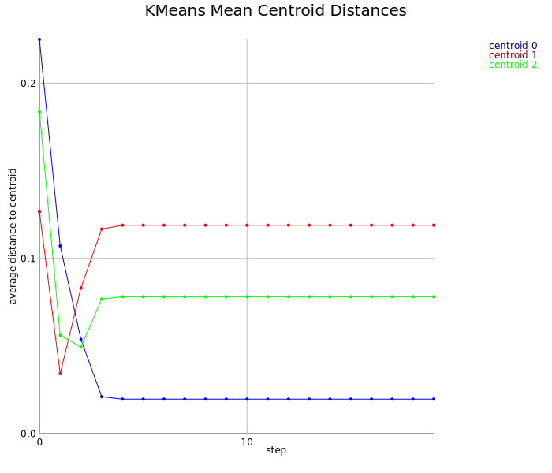

k-Means Clustering
==================

See the wikipedia page on <a href="https://en.wikipedia.org/wiki/K-means_clustering">k-Means Clustering</a>

Clustering Irises
-----------------

A demonstration of k-Means Clustering using the <a href="https://en.wikipedia.org/wiki/Iris_flower_data_set">Iris flower data set</a>

```scala
import axle._
import axle.quanta.Distance
import axle.jung.directedGraphJung
import edu.uci.ics.jung.graph.DirectedSparseGraph
import axle.quanta.UnitOfMeasurement

implicit val distanceConverter = {
  import spire.implicits.DoubleAlgebra
  import axle.algebra.modules.doubleRationalModule
  Distance.converterGraphK2[Double, DirectedSparseGraph]
}
```

Import the Irises data set

```scala
scala> import axle.data.Irises
import axle.data.Irises

scala> import axle.data.Iris
import axle.data.Iris

scala> val irisesData = new Irises
irisesData: axle.data.Irises = axle.data.Irises@576b6eb4
```

Make a 2-D Euclidean space implicitly available for clustering

```scala
import axle.ml.distance.Euclidean
import org.jblas.DoubleMatrix
import axle.jblas.linearAlgebraDoubleMatrix

implicit val space = {
  import spire.implicits.IntAlgebra
  import spire.implicits.DoubleAlgebra
  import axle.jblas.moduleDoubleMatrix
  implicit val inner = axle.jblas.rowVectorInnerProductSpace[Int, Int, Double](2)
  Euclidean[DoubleMatrix, Double]
}
```

Build a classifier of irises based on sepal length and width using the K-Means algorithm

```scala
scala> import axle.ml.KMeans
import axle.ml.KMeans

scala> import axle.ml.PCAFeatureNormalizer
import axle.ml.PCAFeatureNormalizer

scala> import distanceConverter.cm
import distanceConverter.cm

scala> import spire.implicits.DoubleAlgebra
import spire.implicits.DoubleAlgebra

scala> val irisFeaturizer = (iris: Iris) => List((iris.sepalLength in cm).magnitude.toDouble, (iris.sepalWidth in cm).magnitude.toDouble)
irisFeaturizer: axle.data.Iris => List[Double] = <function1>

scala> val normalizer = (PCAFeatureNormalizer[DoubleMatrix] _).curried.apply(0.98)
normalizer: org.jblas.DoubleMatrix => axle.ml.PCAFeatureNormalizer[org.jblas.DoubleMatrix] = <function1>

scala> val irisConstructor = (features: Seq[Double]) => Iris(1 *: cm, 1 *: cm, 1 *: cm, 1 *: cm, "")
irisConstructor: Seq[Double] => axle.data.Iris = <function1>

scala> val classifier = KMeans[Iris, List[Iris], List[Seq[Double]], DoubleMatrix](
     |     irisesData.irises,
     |     N = 2,
     |     irisFeaturizer,
     |     normalizer,
     |     irisConstructor,
     |     K = 3,
     |     iterations = 20)
classifier: axle.ml.KMeans[axle.data.Iris,List[axle.data.Iris],List[Seq[Double]],org.jblas.DoubleMatrix] = <function1>
```

Produce a "confusion matrix"

```scala
scala> import axle.ml.ConfusionMatrix
import axle.ml.ConfusionMatrix

scala> import spire.implicits.IntAlgebra
import spire.implicits.IntAlgebra

scala> import axle.orderStrings
import axle.orderStrings

scala> val confusion = ConfusionMatrix[Iris, Int, String, Vector[Iris], DoubleMatrix, Vector[(String, Int)], Vector[String]](
     |   classifier,
     |   irisesData.irises.toVector,
     |   _.species,
     |   0 to 2)
confusion: axle.ml.ConfusionMatrix[axle.data.Iris,Int,String,Vector[axle.data.Iris],org.jblas.DoubleMatrix,Vector[(String, Int)],Vector[String]] = ConfusionMatrix(<function1>,Vector(Iris(UnittedQuantity(5.1,UnitOfMeasurement(centimeter,cm,None)),UnittedQuantity(3.5,UnitOfMeasurement(centimeter,cm,None)),UnittedQuantity(1.4,UnitOfMeasurement(centimeter,cm,None)),UnittedQuantity(0.2,UnitOfMeasurement(centimeter,cm,None)),Iris-setosa), Iris(UnittedQuantity(4.9,UnitOfMeasurement(centimeter,cm,None)),UnittedQuantity(3.0,UnitOfMeasurement(centimeter,cm,None)),UnittedQuantity(1.4,UnitOfMeasurement(centimeter,cm,None)),UnittedQuantity(0.2,UnitOfMeasurement(centimeter,cm,None)),Iris-setosa), Iris(UnittedQuantity(4.7,UnitOfMeasurement(centimeter,cm,None)),UnittedQuantity(3.2,UnitOfMeasurement(cen...

scala> string(confusion)
res2: String =
"  0  49   1 :  50 Iris-setosa
 12   2  36 :  50 Iris-versicolor
 30   0  20 :  50 Iris-virginica

 42  51  57
"
```

Visualize the final (two dimensional) centroid positions


```scala
scala> import axle.web._
import axle.web._

scala> svg(classifier, "kmeans.svg")
```


Average centroid/cluster vs iteration:

```scala
scala> import scala.collection.immutable.TreeMap
import scala.collection.immutable.TreeMap

scala> import axle.visualize._
import axle.visualize._

scala> val plot = Plot(
     |   classifier.distanceLogSeries,
     |   connect = true,
     |   drawKey = true,
     |   title = Some("KMeans Mean Centroid Distances"),
     |   xAxis = Some(0d),
     |   xAxisLabel = Some("step"),
     |   yAxis = Some(0),
     |   yAxisLabel = Some("average distance to centroid"))
plot: axle.visualize.Plot[Int,Double,scala.collection.immutable.TreeMap[Int,Double]] = Plot(List((centroid 0,Map(0 -> 0.17429129210529598, 1 -> 0.09619251320134992, 2 -> 0.03468816595454645, 3 -> 0.0183632403154321, 4 -> 0.018500728482035458, 5 -> 0.018500728482035458, 6 -> 0.018500728482035458, 7 -> 0.018500728482035458, 8 -> 0.018500728482035458, 9 -> 0.018500728482035458, 10 -> 0.018500728482035458, 11 -> 0.018500728482035458, 12 -> 0.018500728482035458, 13 -> 0.018500728482035458, 14 -> 0.018500728482035458, 15 -> 0.018500728482035458, 16 -> 0.018500728482035458, 17 -> 0.018500728482035458, 18 -> 0.018500728482035458, 19 -> 0.018500728482035458)), (centroid 1,Map(0 -> 0.083947563141331, 1 -> 0.04409450580149785, 2 -> 0.10273648279624621, 3 -> 0.11909836482809741, 4 -> 0.118263090837...

scala> import axle.web._
import axle.web._

scala> svg(plot, "kmeansvsiteration.svg")
```


