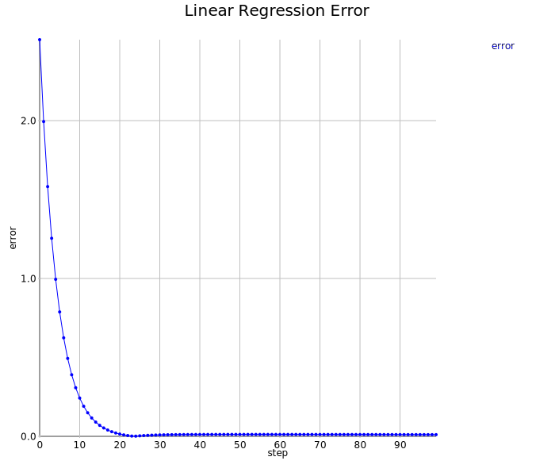

Linear Regression
=================

`axle.ml.LinearRegression` makes use of `axle.algebra.LinearAlgebra`.

See the wikipedia page on <a href="https://en.wikipedia.org/wiki/Linear_regression">Linear Regression</a>

Predicting Home Prices
----------------------

```scala
scala> case class RealtyListing(size: Double, bedrooms: Int, floors: Int, age: Int, price: Double)
defined class RealtyListing

scala> val listings = RealtyListing(2104, 5, 1, 45, 460d) ::
<console>:14: error: value :: is not a member of RealtyListing
       val listings = RealtyListing(2104, 5, 1, 45, 460d) ::
                                                          ^

scala>                RealtyListing(1416, 3, 2, 40, 232d) ::
<console>:15: error: value :: is not a member of RealtyListing
                      RealtyListing(1416, 3, 2, 40, 232d) ::
                                                          ^

scala>                RealtyListing(1534, 3, 2, 30, 315d) ::
<console>:15: error: value :: is not a member of RealtyListing
                      RealtyListing(1534, 3, 2, 30, 315d) ::
                                                          ^

scala>                RealtyListing(852, 2, 1, 36, 178d) ::
<console>:15: error: value :: is not a member of RealtyListing
                      RealtyListing(852, 2, 1, 36, 178d) ::
                                                         ^

scala>                Nil
res3: scala.collection.immutable.Nil.type = List()
```

Create a price estimator using linear regression.

```scala
scala> import axle.jblas._
import axle.jblas._

scala> import spire.implicits.DoubleAlgebra
import spire.implicits.DoubleAlgebra

scala> implicit val laJblasDouble = axle.jblas.linearAlgebraDoubleMatrix[Double]
laJblasDouble: axle.algebra.LinearAlgebra[org.jblas.DoubleMatrix,Int,Int,Double] = axle.jblas.package$$anon$12@6b07e46a

scala> import axle.ml.LinearRegression
import axle.ml.LinearRegression

scala> val estimator = LinearRegression(
     |   listings,
     |   numFeatures = 4,
     |   featureExtractor = (rl: RealtyListing) => (rl.size :: rl.bedrooms.toDouble :: rl.floors.toDouble :: rl.age.toDouble :: Nil),
     |   objectiveExtractor = (rl: RealtyListing) => rl.price,
     |   α = 0.1,
     |   iterations = 100)
<console>:21: error: not found: value listings
         listings,
         ^
```

Use the estimator

```scala
     | estimator.estimate(RealtyListing(1416, 3, 2, 40, 0d))
```

Plot the error during the training

```scala
     | import spire.implicits._
<console>:9: error: ')' expected but 'import' found.
import spire.implicits._
^
     | import axle.visualize._
<console>:9: error: ')' expected but 'import' found.
import axle.visualize._
^
     | import axle.algebra.Plottable._
<console>:9: error: ')' expected but 'import' found.
import axle.algebra.Plottable._
^
     | 
     | val errorPlot = Plot(
<console>:10: error: ')' expected but 'val' found.
val errorPlot = Plot(
^
     |   List(("error" -> estimator.errTree)),
     |   connect = true,
     |   drawKey = true,
     |   title = Some("Linear Regression Error"),
     |   xAxis = Some(0d),
     |   xAxisLabel = Some("step"),
     |   yAxis = Some(0),
     |   yAxisLabel = Some("error"))
<console>:20: error: too many arguments for method apply: (examples: Seq[D], numFeatures: Int, featureExtractor: D => Seq[Double], objectiveExtractor: D => Double, α: Double, iterations: Int)(implicit la: axle.algebra.LinearAlgebra[M,Int,Int,Double])axle.ml.LinearRegression[D,M] in object LinearRegression
       val estimator = LinearRegression(
                                       ^
     | 
     | import axle.web._
<console>:18: error: illegal start of simple expression
import axle.web._
^
     | svg(errorPlot, "lrerror.svg")
```


