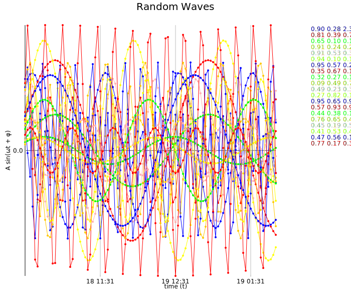

Plots
=====

Two-dimensional plots

Time-series plot example
------------------------

`axle.visualize.Plot`

```scala
scala> import axle._
import axle._

scala> import axle.visualize._
import axle.visualize._

scala> import org.joda.time.DateTime
import org.joda.time.DateTime

scala> import spire.compat.ordering
import spire.compat.ordering

scala> import scala.collection.immutable.TreeMap
import scala.collection.immutable.TreeMap

scala> import scala.math.sin
import scala.math.sin

scala> import scala.util.Random.nextDouble
import scala.util.Random.nextDouble

scala> import axle.joda.dateTimeOrder
import axle.joda.dateTimeOrder

scala> val now = new DateTime()
now: org.joda.time.DateTime = 2016-08-18T18:28:47.584-07:00

scala> def randomTimeSeries(i: Int) = {
     |   val φ = nextDouble
     |   val A = nextDouble
     |   val ω = 0.1 / nextDouble
     |   ("%1.2f %1.2f %1.2f".format(φ, A, ω),
     |     new TreeMap[DateTime, Double]() ++
     |     (0 to 100).map(t => (now.plusMinutes(2 * t) -> A * sin(ω*t + φ))).toMap)
     | }
randomTimeSeries: (i: Int)(String, scala.collection.immutable.TreeMap[org.joda.time.DateTime,Double])

scala> val waves = (0 until 20).map(randomTimeSeries)
waves: scala.collection.immutable.IndexedSeq[(String, scala.collection.immutable.TreeMap[org.joda.time.DateTime,Double])] = Vector((0.46 0.14 0.32,Map(2016-08-18T18:28:47.584-07:00 -> 0.0629743066161165, 2016-08-18T18:30:47.584-07:00 -> 0.09951893452342815, 2016-08-18T18:32:47.584-07:00 -> 0.1260240593199388, 2016-08-18T18:34:47.584-07:00 -> 0.13981583522824925, 2016-08-18T18:36:47.584-07:00 -> 0.13950294332198615, 2016-08-18T18:38:47.584-07:00 -> 0.1251169482403945, 2016-08-18T18:40:47.584-07:00 -> 0.09810911393706492, 2016-08-18T18:42:47.584-07:00 -> 0.06120399969112087, 2016-08-18T18:44:47.584-07:00 -> 0.018124605663796933, 2016-08-18T18:46:47.584-07:00 -> -0.026783204592208534, 2016-08-18T18:48:47.584-07:00 -> -0.06898911628882581, 2016-08-18T18:50:47.584-07:00 -> -0.104235383060486...

scala> import axle.joda.dateTimeZero
import axle.joda.dateTimeZero

scala> implicit val zeroDT = dateTimeZero(now)
zeroDT: axle.algebra.Zero[org.joda.time.DateTime] = axle.joda.package$$anon$3@f6cf70a

scala> import axle.visualize.Plot
import axle.visualize.Plot

scala> import spire.implicits.DoubleAlgebra
import spire.implicits.DoubleAlgebra

scala> import axle.algebra.Plottable.doublePlottable
import axle.algebra.Plottable.doublePlottable

scala> import axle.joda.dateTimeOrder
import axle.joda.dateTimeOrder

scala> import axle.joda.dateTimePlottable
import axle.joda.dateTimePlottable

scala> import axle.joda.dateTimeTics
import axle.joda.dateTimeTics

scala> import axle.joda.dateTimeDurationLengthSpace
import axle.joda.dateTimeDurationLengthSpace

scala> val plot = Plot(
     |   waves,
     |   title = Some("Random Waves"),
     |   xAxis = Some(0d),
     |   xAxisLabel = Some("time (t)"),
     |   yAxisLabel = Some("A sin(ωt + φ)"))
plot: axle.visualize.Plot[org.joda.time.DateTime,Double,scala.collection.immutable.TreeMap[org.joda.time.DateTime,Double]] = Plot(Vector((0.46 0.14 0.32,Map(2016-08-18T18:28:47.584-07:00 -> 0.0629743066161165, 2016-08-18T18:30:47.584-07:00 -> 0.09951893452342815, 2016-08-18T18:32:47.584-07:00 -> 0.1260240593199388, 2016-08-18T18:34:47.584-07:00 -> 0.13981583522824925, 2016-08-18T18:36:47.584-07:00 -> 0.13950294332198615, 2016-08-18T18:38:47.584-07:00 -> 0.1251169482403945, 2016-08-18T18:40:47.584-07:00 -> 0.09810911393706492, 2016-08-18T18:42:47.584-07:00 -> 0.06120399969112087, 2016-08-18T18:44:47.584-07:00 -> 0.018124605663796933, 2016-08-18T18:46:47.584-07:00 -> -0.026783204592208534, 2016-08-18T18:48:47.584-07:00 -> -0.06898911628882581, 2016-08-18T18:50:47.584-07:00 -> -0.104235383...

scala> import axle.web._
import axle.web._

scala> svg(plot, "waves.svg")
```



Animation
---------

This example traces two "saw" functions vs time:

```scala
import collection.immutable.TreeMap
import org.joda.time.DateTime
import axle.joda._
import spire.compat.ordering

val initialData = List(
  ("saw 1", new TreeMap[DateTime, Double]()),
  ("saw 2", new TreeMap[DateTime, Double]())
)

import spire.implicits.DoubleAlgebra
import axle.visualize._

val now = new DateTime()
implicit val dtz = dateTimeZero(now)

val plot = Plot[DateTime, Double, TreeMap[DateTime, Double]](
  initialData,
  connect = true,
  title = Some("Saws"),
  xAxis = Some(0d),
  xAxisLabel = Some("time (t)"),
  yAxisLabel = Some("y")
)

val saw1 = (t: Long) => (t % 10000) / 10000d
val saw2 = (t: Long) => (t % 100000) / 50000d

val fs = List(saw1, saw2)

val refreshFn = (previous: List[(String, TreeMap[DateTime, Double])]) => {
  val now = new DateTime()
  previous.zip(fs).map({ case (old, f) => (old._1, old._2 ++ Vector(now -> f(now.getMillis))) })
}

import akka.actor.ActorSystem
implicit val system = ActorSystem("Animator")

import axle.jung._
import axle.quanta.Time
import edu.uci.ics.jung.graph.DirectedSparseGraph

implicit val timeConverter = {
  import axle.algebra.modules.doubleRationalModule
  Time.converterGraphK2[Double, DirectedSparseGraph]
}
import timeConverter.millisecond

play(plot, refreshFn, 500 *: millisecond)
```
