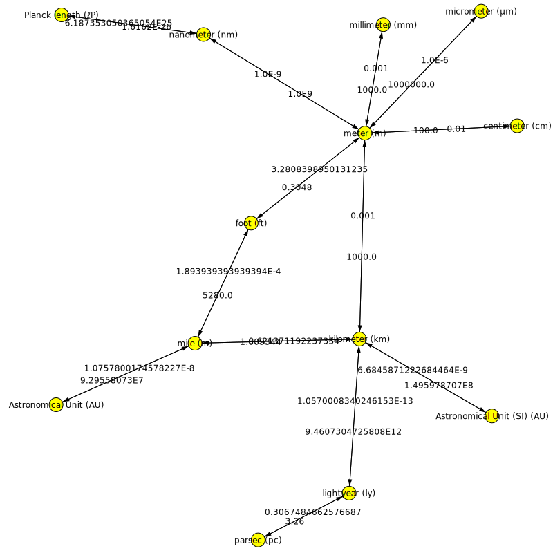

Quanta, Units, and Conversions
==============================

`UnittedQuantity` is the primary case class in `axle.quanta`

Introduction
------------

The `axle.quanta` package models units of measurement.
Via typeclasses, it implements expected operators like `+ - * over by`,
a unit conversion operator `in`,
and a right associative value constructor `*:`

The "quanta" are
Acceleration, Area, Angle, 
<a href={"https://github.com/adampingel/axle/blob/master/axle-core/src/main/scala/axle/quanta/Distance.scala"}>Distance</a>,
<a href={"https://github.com/adampingel/axle/blob/master/axle-core/src/main/scala/axle/quanta/Energy.scala"}>Energy</a>,
Flow, Force, Frequency, Information, Mass, Money, MoneyFlow, MoneyPerForce, Power, Speed, Temperature,
<a href={"https://github.com/adampingel/axle/blob/master/axle-core/src/main/scala/axle/quanta/Time.scala"}>Time</a>,
and Volume.
Axle's values are represented in such a way that a value's "quantum" is present in the type,
meaning that nonsensical expressions like `mile + gram` can be rejected at compile time.



Additionally, various values within the Quantum objects are imported.
This package uses the definition of "Quantum" as "something that can
be quantified or measured".

```scala
scala> import axle._
import axle._

scala> import axle.quanta._
import axle.quanta._

scala> import axle.jung.directedGraphJung
import axle.jung.directedGraphJung

scala> import spire.implicits.additiveSemigroupOps
import spire.implicits.additiveSemigroupOps

scala> import spire.implicits.additiveGroupOps
import spire.implicits.additiveGroupOps

scala> import spire.implicits.moduleOps
import spire.implicits.moduleOps
```

Quanta each define a Wikipedia link where you can find out more
about relative scale:

```scala
scala> Distance().wikipediaUrl
res0: String = http://en.wikipedia.org/wiki/Orders_of_magnitude_(length)
```

A visualization of each Quantum (like the one for Distance shown above) is produced with:

```scala
scala> import axle.algebra.modules.doubleRationalModule
import axle.algebra.modules.doubleRationalModule

scala> import spire.implicits.DoubleAlgebra
import spire.implicits.DoubleAlgebra

scala> import axle.jung.directedGraphJung
import axle.jung.directedGraphJung

scala> import edu.uci.ics.jung.graph.DirectedSparseGraph
import edu.uci.ics.jung.graph.DirectedSparseGraph

scala> implicit val distanceConverter = Distance.converterGraphK2[Double, DirectedSparseGraph]
distanceConverter: axle.quanta.UnitConverterGraph[axle.quanta.Distance,Double,edu.uci.ics.jung.graph.DirectedSparseGraph[axle.quanta.UnitOfMeasurement[axle.quanta.Distance],Double => Double]] with axle.quanta.DistanceConverter[Double] = axle.quanta.Distance$$anon$1@1008efd7

scala> implicit val showDDAt1 = new Show[Double => Double] {
     |   def text(f: Double => Double): String = f(1d).toString
     | }
showDDAt1: axle.Show[Double => Double] = $anon$1@4c3f44b7

scala> import axle.visualize._
import axle.visualize._

scala> import axle.web._
import axle.web._

scala> svg(distanceConverter.conversionGraph, "Distance.svg")
java.lang.NoClassDefFoundError: edu/uci/ics/jung/visualization/DefaultVisualizationModel
  at axle.web.SVG$$anon$18.svg(SVG.scala:495)
  at axle.web.SVG$$anon$18.svg(SVG.scala:479)
  at axle.web.package$.svg(package.scala:26)
  ... 502 elided
```

// TODO
// import axle.syntax.directedgraph.directedGraphOps
// import axle.syntax.functor.functorOps
// val g = cg.mapEdges(f => f(1d))

Units
-----

A conversion graph must be created with type parameters specifying the numeric type to
be used in unitted quantity, as well as a directed graph type that will store the conversion
graph.
The conversion graphs should be placed in implicit scope.
Within each are defined units of measurement which can be imported.

```scala
scala> import spire.implicits.DoubleAlgebra
import spire.implicits.DoubleAlgebra

scala> implicit val massConverter = Mass.converterGraphK2[Double, DirectedSparseGraph]
massConverter: axle.quanta.UnitConverterGraph[axle.quanta.Mass,Double,edu.uci.ics.jung.graph.DirectedSparseGraph[axle.quanta.UnitOfMeasurement[axle.quanta.Mass],Double => Double]] with axle.quanta.MassConverter[Double] = axle.quanta.Mass$$anon$1@3caab8d9

scala> import massConverter._
import massConverter._

scala> implicit val powerConverter = Power.converterGraphK2[Double, DirectedSparseGraph]
powerConverter: axle.quanta.UnitConverterGraph[axle.quanta.Power,Double,edu.uci.ics.jung.graph.DirectedSparseGraph[axle.quanta.UnitOfMeasurement[axle.quanta.Power],Double => Double]] with axle.quanta.PowerConverter[Double] = axle.quanta.Power$$anon$1@10adac26

scala> import powerConverter._
import powerConverter._

scala> implicit val energyConverter = Energy.converterGraphK2[Double, DirectedSparseGraph]
energyConverter: axle.quanta.UnitConverterGraph[axle.quanta.Energy,Double,edu.uci.ics.jung.graph.DirectedSparseGraph[axle.quanta.UnitOfMeasurement[axle.quanta.Energy],Double => Double]] with axle.quanta.EnergyConverter[Double] = axle.quanta.Energy$$anon$1@6fe19ac3

scala> import energyConverter._
import energyConverter._

scala> import axle.algebra.modules.doubleRationalModule
import axle.algebra.modules.doubleRationalModule

scala> implicit val distanceConverter = Distance.converterGraphK2[Double, DirectedSparseGraph]
distanceConverter: axle.quanta.UnitConverterGraph[axle.quanta.Distance,Double,edu.uci.ics.jung.graph.DirectedSparseGraph[axle.quanta.UnitOfMeasurement[axle.quanta.Distance],Double => Double]] with axle.quanta.DistanceConverter[Double] = axle.quanta.Distance$$anon$1@71002ac9

scala> import distanceConverter._
import distanceConverter._

scala> implicit val timeConverter = Time.converterGraphK2[Double, DirectedSparseGraph]
timeConverter: axle.quanta.UnitConverterGraph[axle.quanta.Time,Double,edu.uci.ics.jung.graph.DirectedSparseGraph[axle.quanta.UnitOfMeasurement[axle.quanta.Time],Double => Double]] with axle.quanta.TimeConverter[Double] = axle.quanta.Time$$anon$1@401510b3

scala> import timeConverter._
import timeConverter._
```

Standard Units of Measurement are defined:

```scala
scala> gram
res2: axle.quanta.UnitOfMeasurement[axle.quanta.Mass] = UnitOfMeasurement(gram,g,None)

scala> foot
res3: axle.quanta.UnitOfMeasurement[axle.quanta.Distance] = UnitOfMeasurement(foot,ft,None)

scala> meter
res4: axle.quanta.UnitOfMeasurement[axle.quanta.Distance] = UnitOfMeasurement(meter,m,None)
```

Construction
------------

Values with units are constructed with the right-associative `*:` method on any spire `Number` type
as long as a spire `Field` is implicitly available.

```scala
scala> 10d *: gram
res5: axle.quanta.UnittedQuantity[axle.quanta.Mass,Double] = UnittedQuantity(10.0,UnitOfMeasurement(gram,g,None))

scala> 3d *: lightyear
res6: axle.quanta.UnittedQuantity[axle.quanta.Distance,Double] = UnittedQuantity(3.0,UnitOfMeasurement(lightyear,ly,Some(http://en.wikipedia.org/wiki/Light-year)))

scala> 5d *: horsepower
res7: axle.quanta.UnittedQuantity[axle.quanta.Power,Double] = UnittedQuantity(5.0,UnitOfMeasurement(horsepower,hp,None))

scala> 3.14 *: second
res8: axle.quanta.UnittedQuantity[axle.quanta.Time,Double] = UnittedQuantity(3.14,UnitOfMeasurement(second,s,Some(http://en.wikipedia.org/wiki/Second)))

scala> 200d *: watt
res9: axle.quanta.UnittedQuantity[axle.quanta.Power,Double] = UnittedQuantity(200.0,UnitOfMeasurement(watt,W,None))
```

Conversion
----------

A Quantum defines a directed graph, where the UnitsOfMeasurement
are the vertices, and the Conversions define the directed edges.
See the <a href={"/graph.html"}>Graph</a> package for more on how graphs work.

Quantities can be converted into other units of measurement.
This is possible as long as 1) the values are in the same
Quantum, and 2) there is a path in the Quantum between the two.

```scala
scala> 10d *: gram in kilogram
res10: axle.quanta.UnittedQuantity[axle.quanta.Mass,Double] = UnittedQuantity(0.01,UnitOfMeasurement(kilogram,Kg,None))
```

Converting between quanta is not allowed, and is caught at compile time:

```scala
scala> (1 *: gram) in mile
<console>:57: error: type mismatch;
 found   : axle.quanta.UnitOfMeasurement[axle.quanta.Distance]
 required: axle.quanta.UnitOfMeasurement[axle.quanta.Mass]
       (1 *: gram) in mile
                      ^
```

Show
----

A witness for the `Show` typeclass is defined, meaning that `string` will return
a `String` representation, and `show` will send it to stdout.

```scala
scala> string(10d *: gram in kilogram)
res12: String = 0.010000 Kg
```

Math
----

Addition and subtraction are defined on Quantity by converting the
right Quantity to the unit of the left.

```scala
scala> (1d *: kilogram) + (10d *: gram)
res13: axle.quanta.UnittedQuantity[axle.quanta.Mass,Double] = UnittedQuantity(1010.0,UnitOfMeasurement(gram,g,None))

scala> (7d *: mile) - (123d *: foot)
res14: axle.quanta.UnittedQuantity[axle.quanta.Distance,Double] = UnittedQuantity(36837.0,UnitOfMeasurement(foot,ft,None))
```

Addition and subtraction between different quanta is rejected at compile time:

```scala
scala> (1d *: newton) + (2d *: foot)
<console>:57: error: not found: value newton
       (1d *: newton) + (2d *: foot)
              ^
```

Multiplication comes from spire's Module typeclass:

```scala
scala> (5.4 *: second) :* 100d
res16: axle.quanta.UnittedQuantity[axle.quanta.Time,Double] = UnittedQuantity(540.0,UnitOfMeasurement(second,s,Some(http://en.wikipedia.org/wiki/Second)))

scala> (32d *: century) :* (1d/3)
res17: axle.quanta.UnittedQuantity[axle.quanta.Time,Double] = UnittedQuantity(10.666666666666666,UnitOfMeasurement(century,century,Some(http://en.wikipedia.org/wiki/Century)))
```

The methods `over` and `by` are used to multiply and divide other values with units.
This behavior is not yet implemented.
