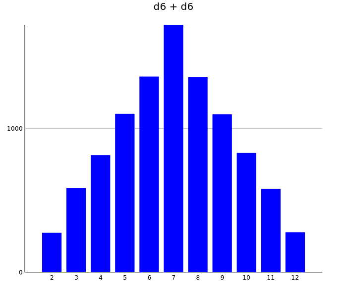
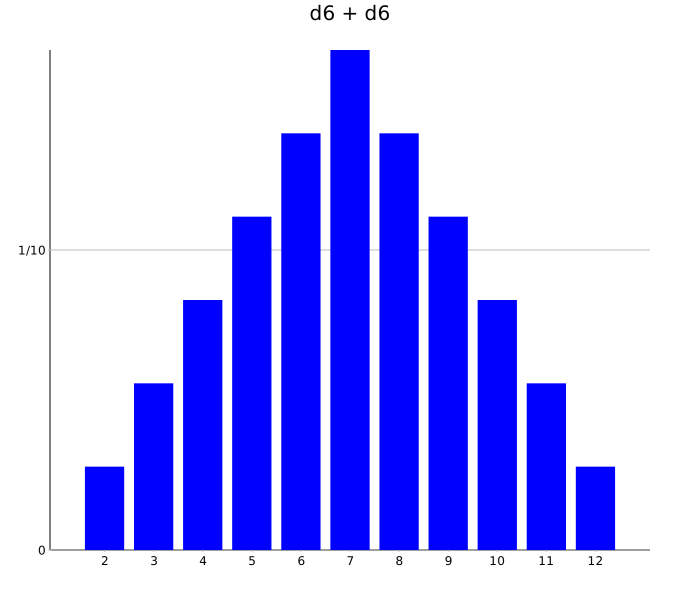

Two Dice
========

This page describes two ways of calculation the sum of two dice rolls.

Simulation
----------

Imports

```scala
import spire.math._
import spire.algebra._
import axle._
import axle.stats._
import axle.game.Dice._
```

Simulate 10k rolls of two dice

```scala
scala> val d6a = die(6)
d6a: axle.stats.Distribution0[Int,spire.math.Rational] = ConditionalProbabilityTable0(Map(5 -> 1/6, 1 -> 1/6, 6 -> 1/6, 2 -> 1/6, 3 -> 1/6, 4 -> 1/6),d6)

scala> val d6b = die(6)
d6b: axle.stats.Distribution0[Int,spire.math.Rational] = ConditionalProbabilityTable0(Map(5 -> 1/6, 1 -> 1/6, 6 -> 1/6, 2 -> 1/6, 3 -> 1/6, 4 -> 1/6),d6)

scala> import spire.implicits.IntAlgebra
import spire.implicits.IntAlgebra

scala> val histogram =
     |   (0 until 10000).
     |   map(i => d6a.observe + d6b.observe).
     |   tally
histogram: Map[Int,Int] = Map(5 -> 1102, 10 -> 830, 6 -> 1361, 9 -> 1098, 2 -> 275, 12 -> 278, 7 -> 1721, 3 -> 585, 11 -> 579, 8 -> 1356, 4 -> 815)
```

Define visualization

```scala
scala> import axle.visualize.Color.blue
import axle.visualize.Color.blue

scala> import axle.visualize._
import axle.visualize._

scala> val chart = BarChart[Int, Int, Map[Int, Int]](
     |   histogram,
     |   xAxis = Some(0),
     |   title = Some("d6 + d6"),
     |   labelAngle = 0d *: angleDouble.degree,
     |   colors = List(blue),
     |   drawKey = false)
chart: axle.visualize.BarChart[Int,Int,Map[Int,Int]] = BarChart(Map(5 -> 1102, 10 -> 830, 6 -> 1361, 9 -> 1098, 2 -> 275, 12 -> 278, 7 -> 1721, 3 -> 585, 11 -> 579, 8 -> 1356, 4 -> 815),false,700,600,50,0.8,20,50,80,Some(d6 + d6),None,Courier New,12,Palatino,20,Some(0),None,None,UnittedQuantity(0.0,UnitOfMeasurement(degree,°,Some(http://en.wikipedia.org/wiki/Degree_(angle)))),List(Color(0,0,255)))
```

Create SVG

```scala
scala> import axle.web._
import axle.web._

scala> svg(chart, "d6plusd6.svg")
```



Distribution Monad

The distribution of two rolls combined can be produced with a for comprehension
and charted directly.

Imports (Note: documentation resets interpreter here)

```scala
scala> import spire.math._
import spire.math._

scala> import spire.algebra._
import spire.algebra._

scala> import axle._
import axle._

scala> import axle.stats._
import axle.stats._

scala> import axle.game.Dice.die
import axle.game.Dice.die
```

Create probability distribution of the addition of two 6-sided die:

```scala
scala> val distribution = for {
     |   a <- die(6)
     |   b <- die(6)
     | } yield a + b
distribution: axle.stats.Distribution0[Int,spire.math.Rational] = ConditionalProbabilityTable0(Map(5 -> 1/9, 10 -> 1/12, 6 -> 5/36, 9 -> 1/9, 2 -> 1/36, 12 -> 1/36, 7 -> 1/6, 3 -> 1/18, 11 -> 1/18, 8 -> 5/36, 4 -> 1/12),unnamed)
```

Define visualization

```scala
scala> import axle.visualize._
import axle.visualize._

scala> import axle.visualize.Color.blue
import axle.visualize.Color.blue

scala> import spire.implicits.IntAlgebra
import spire.implicits.IntAlgebra

scala> val chart = BarChart[Int, Rational, Distribution0[Int, Rational]](
     |   distribution,
     |   xAxis = Some(Rational(0)),
     |   title = Some("d6 + d6"),
     |   labelAngle = 0d *: angleDouble.degree,
     |   colors = List(blue),
     |   drawKey = false)
chart: axle.visualize.BarChart[Int,spire.math.Rational,axle.stats.Distribution0[Int,spire.math.Rational]] = BarChart(ConditionalProbabilityTable0(Map(5 -> 1/9, 10 -> 1/12, 6 -> 5/36, 9 -> 1/9, 2 -> 1/36, 12 -> 1/36, 7 -> 1/6, 3 -> 1/18, 11 -> 1/18, 8 -> 5/36, 4 -> 1/12),unnamed),false,700,600,50,0.8,20,50,80,Some(d6 + d6),None,Courier New,12,Palatino,20,Some(0),None,None,UnittedQuantity(0.0,UnitOfMeasurement(degree,°,Some(http://en.wikipedia.org/wiki/Degree_(angle)))),List(Color(0,0,255)))
```

Create SVG

```scala
scala> import axle.web._
import axle.web._

scala> svg(chart, "distributionMonad.svg")
```


